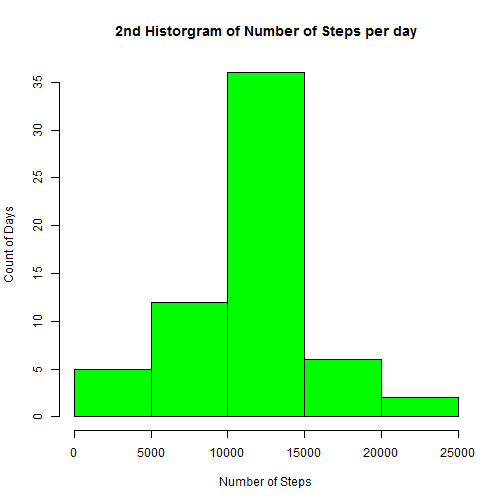

Reproducible Research - Project 1
=================================

## 1. Mean and Total Steps

### Load Data

```r
fit <- read.csv("activity.csv")
```


### Omit NA & Aggregate number of steps per day

```r
fit2 <- na.omit(fit)
fit3 <- aggregate(fit2$steps, fit2[2], sum)
```


### Draw a histr plot for number of steps in a day

```r
hist(fit3$x, col = "green", main = "Historgram of Number of Steps per day", 
    xlab = "Number of Steps", ylab = "Count of Days")
```

 


### Computing Mean steps

```r
mean(fit3$x)
```

```
## [1] 10766
```


### Computing Median steps

```r
median(fit3$x)
```

```
## [1] 10765
```

## 2. Average Daily Activity Pattern

### Creating 5 min plot intervals

Find average across intervals


```r
fit4 <- aggregate(fit2$steps, fit2[3], mean)
```


Draw Plot

```r
plot(x ~ interval, data = fit4, type = "l", col = "red", xlab = "At Interval", 
    ylab = "Mean steps per day", main = "Average Daily Activity Pattern")
```

 


### Peak Interval

```r
fit4[which(fit4$x == max(fit4$x)), 1]
```

```
## [1] 835
```


## 3. Imputing Missing Values

### Count Missing Values

```r
missing <- nrow(fit[(!complete.cases(fit)), ])
```

The number of rows with missing data are 2304.

### Fill in Missing Values


```r
fit5 <- aggregate(fit2$steps, fit2[3], mean)
fit6 <- merge(x = fit, y = fit5, by = "interval", all.x = TRUE)
fit6$steps <- ifelse(is.na(fit6$steps), fit6$x, fit6$steps)
fit7 <- fit6[, -c(4)]
```


### Draw 2nd Hist of Steps per Day


```r
fit8 <- aggregate(fit7$steps, fit7[3], sum)
hist(fit8$x, col = "green", main = "2nd Historgram of Number of Steps per day", 
    xlab = "Number of Steps", ylab = "Count of Days")
```

 


### Computing 2nd Mean

```r
mean(fit8$x)
```

```
## [1] 10766
```


### Computing 2nd Median

```r
median(fit8$x)
```

```
## [1] 10766
```


## 4. Activity Pattern: Weekdays vs Weekends

Factoring Weekday and Weekend from Date


```r
fit9 <- fit7
fit9$date1 <- as.Date(fit9$date, format = "%Y-%m-%d")
fit9$flag1 <- weekdays(fit9$date1)
fit9$flag2 <- fit9$flag1 == "Sunday" | fit9$flag1 == "Saturday"
fit9$flag3 <- factor(ifelse(fit9$flag2, "weekend", "weekday"))
```


Plot to compare activity by Weekday/Weekend

```r
fit10 <- aggregate(fit9$steps, fit9[c(1, 7)], mean)
library(lattice)
xyplot(x ~ interval | flag3, data = fit10, layout = c(1, 2), type = "l", xlab = "Interval", 
    ylab = "Number of steps")
```

 

