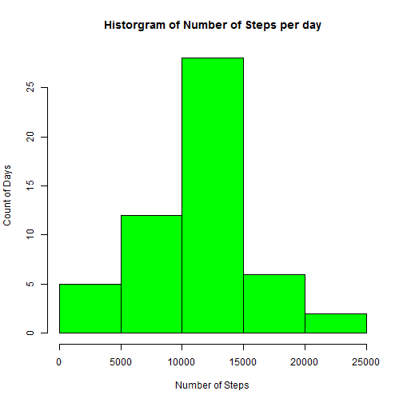
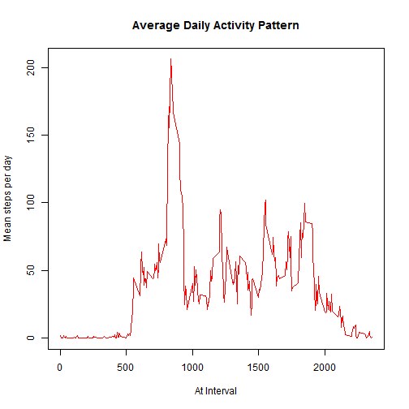

Reproducible Research - Project 1
=================================

## 1. Mean and Total Steps

### Load Data

```r
fit <- read.csv("activity.csv")
```


### Omit NA & Aggregate number of steps per day

```r
fit2 <- na.omit(fit)
fit3 <- aggregate(fit2$steps, fit2[2], sum)
```


### Draw a histr plot for number of steps in a day

```r
hist(fit3$x, col = "green", main = "Historgram of Number of Steps per day", 
    xlab = "Number of Steps", ylab = "Count of Days")
```

 


### Computing Mean

```r
mean(fit3$x)
```

```
## [1] 10766
```


### Computing Mean

```r
median(fit3$x)
```

```
## [1] 10765
```

## 2. Average Daily Activity Pattern

### Creating 5 min plot intervals

Find average across intervals


```r
fit4 <- aggregate(fit2$steps, fit2[3], mean)
```


Draw Plot

```r
plot(x ~ interval, data = fit4, type = "l", col = "red", xlab = "At Interval", 
    ylab = "Mean steps per day", main = "Average Daily Activity Pattern")
```

 


### Peak Interval

```r
fit4[which(fit4$x == max(fit4$x)), 1]
```

```
## [1] 835
```


## 3. Imputing Missing Values

### Count Missing Values

```r
nrow(fit[(!complete.cases(fit)), ])
```

```
## [1] 2304
```

```
